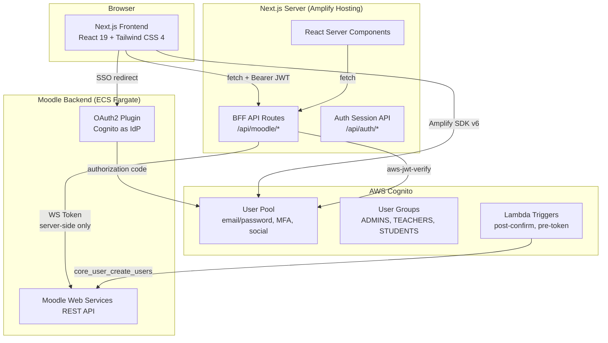
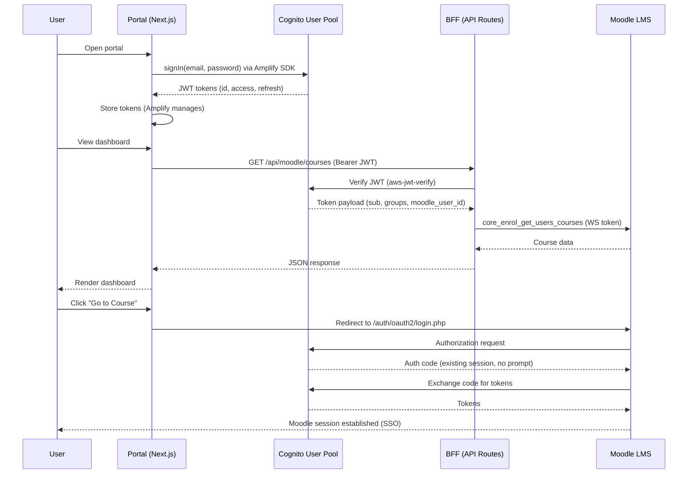
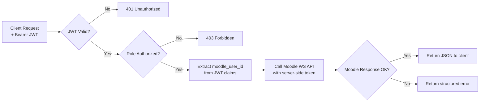
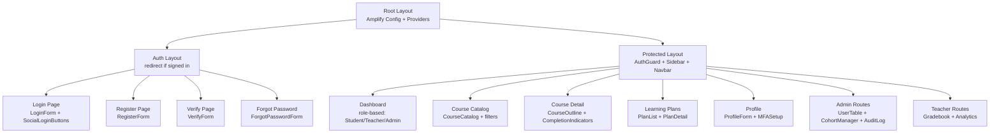

# Design Document: ECV LMS Frontend Portal

## Overview

The ECV LMS Frontend Portal is a Next.js 15 (App Router) application that serves as a branded entry point for ECV Learning Solutions' Moodle LMS. It provides authentication via AWS Cognito (Amplify SDK v6), role-based dashboards, course catalog/syllabus views, learning plan management, and comprehensive user administration. All Moodle data flows through a Backend-for-Frontend (BFF) layer implemented as Next.js API Route Handlers, ensuring Moodle credentials never reach the browser.

Reference: [FrontendRequirement.md](../../FrontendRequirement.md)

## Architecture

### High-Level Architecture



### Authentication Flow



### BFF Request Flow



## Components and Interfaces

### 1. Authentication Layer

#### Amplify Configuration (`lib/amplify-config.ts`)
- Configures Amplify SDK v6 with Cognito User Pool ID, Client ID, OAuth domain
- Called once in root layout before any auth operations
- Uses environment variables: `NEXT_PUBLIC_COGNITO_USER_POOL_ID`, `NEXT_PUBLIC_COGNITO_CLIENT_ID`, `NEXT_PUBLIC_COGNITO_DOMAIN`

#### Auth Context (`contexts/AuthContext.tsx`)
```typescript
interface AuthContextValue {
  user: AuthUser | null;
  role: 'ADMIN' | 'TEACHER' | 'STUDENT' | null;
  isLoading: boolean;
  isAuthenticated: boolean;
  signIn: (email: string, password: string) => Promise<SignInResult>;
  signUp: (params: SignUpParams) => Promise<SignUpResult>;
  signOut: () => Promise<void>;
  confirmSignUp: (email: string, code: string) => Promise<void>;
  resetPassword: (email: string) => Promise<void>;
  confirmResetPassword: (email: string, code: string, newPassword: string) => Promise<void>;
}
```

#### Auth Guard (`components/auth/AuthGuard.tsx`)
- Wraps protected route layouts
- Checks `isAuthenticated` from AuthContext
- Redirects to `/login?redirect={currentPath}` if unauthenticated
- Checks role against allowed roles for admin/teacher routes
- Renders children or access denied message

#### Role Resolver (`lib/auth/roles.ts`)
```typescript
function resolveRole(session: AuthSession): 'ADMIN' | 'TEACHER' | 'STUDENT';
// Extracts cognito:groups from access token payload
// Returns highest-precedence role: ADMIN > TEACHER > STUDENT
// Throws if no recognized group found
```

### 2. BFF Layer

#### JWT Verifier (`lib/auth/jwt-verifier.ts`)
```typescript
// Singleton CognitoJwtVerifier instance
const verifier = CognitoJwtVerifier.create({
  userPoolId: process.env.COGNITO_USER_POOL_ID,
  clientId: process.env.COGNITO_CLIENT_ID,
  tokenUse: 'access',
});

async function verifyRequest(request: NextRequest): Promise<JwtPayload>;
// Extracts Bearer token from Authorization header
// Verifies with aws-jwt-verify
// Returns decoded payload or throws
```

#### Moodle REST Client (`lib/moodle/client.ts`)
```typescript
interface MoodleClient {
  call<T>(wsfunction: string, params: Record<string, unknown>): Promise<T>;
}

class MoodleRestClient implements MoodleClient {
  constructor(
    private baseUrl: string,    // MOODLE_URL env var
    private wsToken: string,    // MOODLE_WS_TOKEN env var (server-only)
  );

  async call<T>(wsfunction: string, params: Record<string, unknown>): Promise<T>;
  // POST to {baseUrl}/webservice/rest/server.php
  // Includes wstoken, wsfunction, moodlewsrestformat=json
  // Handles Moodle error responses (exception field)
}
```

#### BFF Route Handler Pattern
```typescript
// Example: app/api/moodle/courses/route.ts
export async function GET(request: NextRequest) {
  const payload = await verifyRequest(request);           // 401 if invalid
  assertRole(payload, ['ADMIN', 'TEACHER', 'STUDENT']);   // 403 if wrong role
  const moodleUserId = payload['custom:moodle_user_id'];
  const courses = await moodleClient.call('core_enrol_get_users_courses', {
    userid: moodleUserId,
  });
  return NextResponse.json(courses);
}
```

### 3. Frontend Data Hooks (TanStack Query)

```typescript
// hooks/useCourses.ts
function useCourses(options?: { category?: number; search?: string }): UseQueryResult<Course[]>;
function useCourseDetail(courseId: number): UseQueryResult<CourseDetail>;
function useCourseContents(courseId: number): UseQueryResult<CourseSection[]>;

// hooks/useUsers.ts (admin)
function useUsers(filters: UserFilters): UseQueryResult<PaginatedResult<User>>;
function useCreateUser(): UseMutationResult<User, Error, CreateUserParams>;
function useBulkImportUsers(): UseMutationResult<ImportResult, Error, File>;

// hooks/useLearningPlans.ts
function useMyPlans(): UseQueryResult<LearningPlan[]>;
function usePlanDetail(planId: number): UseQueryResult<PlanDetail>;
function usePlanCompetencies(planId: number): UseQueryResult<PlanCompetency[]>;

// hooks/useEnrollments.ts
function useEnrollSelf(courseId: number): UseMutationResult<void, Error, { enrollKey?: string }>;
function useBatchEnroll(): UseMutationResult<void, Error, BatchEnrollParams>;
```

### 4. UI Component Hierarchy



### 5. CSV Processing Module

```typescript
// lib/csv/processor.ts
interface CsvValidationResult {
  validRows: UserImportRow[];
  errors: CsvValidationError[];
  totalRows: number;
}

interface CsvValidationError {
  row: number;
  column: string;
  value: string;
  message: string;
}

function validateUserImportCsv(file: File): Promise<CsvValidationResult>;
// Parses CSV, validates required fields (email, firstname, lastname, role)
// Validates email format, role enum, optional field formats
// Returns valid rows and detailed error report

function generateUserExportCsv(users: User[], fields: string[]): string;
// Generates CSV string from user data with selected fields
```

### 6. Internationalization

```typescript
// lib/utils/i18n.ts
type Locale = 'th' | 'en';

interface I18nContext {
  locale: Locale;
  setLocale: (locale: Locale) => void;
  t: (key: string, params?: Record<string, string>) => string;
  formatDate: (date: Date) => string;  // Thai Buddhist calendar when locale=th
}
```

### 7. Cognito Lambda Triggers

#### Post-Confirmation Lambda
- Trigger: User confirms email after sign-up
- Extracts `email`, `given_name`, `family_name` from Cognito event
- Calls Moodle `core_user_create_users` to create matching Moodle user
- Stores returned `moodle_user_id` as custom Cognito attribute
- Adds user to STUDENTS Cognito group by default

#### Pre-Token Generation Lambda
- Trigger: Before token issuance
- Adds `custom:moodle_user_id` and `custom:institution` to ID token claims
- Adds `custom:permissions` (derived from Cognito groups) to access token claims


## Data Models

### User Models

```typescript
interface AuthUser {
  cognitoSub: string;
  email: string;
  givenName: string;
  familyName: string;
  role: 'ADMIN' | 'TEACHER' | 'STUDENT';
  moodleUserId: number;
  institution?: string;
  locale: 'th' | 'en';
}

interface UserListItem {
  id: number;                // Moodle user ID
  cognitoSub: string;
  email: string;
  firstname: string;
  lastname: string;
  role: 'ADMIN' | 'TEACHER' | 'STUDENT';
  status: 'active' | 'suspended' | 'archived';
  enrolledCoursesCount: number;
  lastLogin: string | null;  // ISO date
  createdAt: string;         // ISO date
  cohorts: string[];
}

interface UserProfile extends UserListItem {
  phone?: string;
  avatar?: string;
  institution?: string;
  department?: string;
  timezone: string;
  language: 'th' | 'en';
  enrolledCourses: CourseEnrollment[];
  completedCourses: CourseEnrollment[];
  badges: Badge[];
  certificates: Certificate[];
  learningPlans: LearningPlanSummary[];
  totalLearningHours: number;
}

interface UserImportRow {
  email: string;
  firstname: string;
  lastname: string;
  role: 'STUDENT' | 'TEACHER' | 'ADMIN';
  password?: string;
  cohort?: string;
  institution?: string;
  department?: string;
  phone?: string;
  language?: 'th' | 'en';
}
```

### Course Models

```typescript
interface Course {
  id: number;
  shortname: string;
  fullname: string;
  summary: string;
  categoryId: number;
  categoryName: string;
  imageUrl?: string;
  instructorName: string;
  duration?: string;
  difficulty?: 'beginner' | 'intermediate' | 'advanced' | 'expert';
  language?: string;
  credits?: number;
  enrolledCount: number;
  startDate: string;
  endDate?: string;
  visible: boolean;
}

interface CourseDetail extends Course {
  prerequisites: Course[];
  enrollmentMethods: EnrollmentMethod[];
  completionCriteria: CompletionCriteria;
  competencies: CourseCompetency[];
  tags: string[];
  maxEnrollment?: number;
}

interface CourseSection {
  id: number;
  name: string;
  summary: string;
  sectionNumber: number;
  visible: boolean;
  learningObjectives?: string[];
  modules: CourseModule[];
}

interface CourseModule {
  id: number;
  name: string;
  modname: string;  // 'quiz' | 'assign' | 'forum' | 'lesson' | 'h5pactivity' | 'resource' | 'url' | 'page'
  description?: string;
  url?: string;
  completionState: 'not_started' | 'in_progress' | 'completed';
  gradeWeight?: number;
  estimatedDuration?: string;
  available: boolean;  // false if prerequisites not met
  prerequisiteMessage?: string;
}

interface CourseEnrollment {
  courseId: number;
  courseName: string;
  enrollmentDate: string;
  progress: number;        // 0-100
  completionStatus: 'not_started' | 'in_progress' | 'completed';
  grade?: number;
  lastAccessed?: string;
}

interface CourseCategory {
  id: number;
  name: string;
  parentId: number | null;
  courseCount: number;
  children: CourseCategory[];
}
```

### Learning Plan Models

```typescript
interface CompetencyFramework {
  id: number;
  shortname: string;
  name: string;
  description: string;
  competencyCount: number;
  linkedCourseCount: number;
  proficiencyScale: ProficiencyLevel[];
}

interface ProficiencyLevel {
  id: number;
  name: string;
  sortOrder: number;
  isDefault: boolean;
  isProficient: boolean;
}

interface Competency {
  id: number;
  shortname: string;
  name: string;
  description: string;
  frameworkId: number;
  parentId: number | null;
  sortOrder: number;
  children: Competency[];
}

interface PlanTemplate {
  id: number;
  name: string;
  description: string;
  dueDateMode: 'fixed' | 'relative';
  dueDate?: string;
  relativeDueDays?: number;
  competencies: TemplateCompetency[];
  assignedUserCount: number;
  assignedCohortCount: number;
  status: 'draft' | 'active';
}

interface TemplateCompetency {
  competencyId: number;
  competencyName: string;
  frameworkName: string;
  requiredProficiencyLevel: number;
  sortOrder: number;
}

interface LearningPlan {
  id: number;
  name: string;
  description: string;
  userId: number;
  templateId?: number;
  status: 'draft' | 'waiting_for_review' | 'in_review' | 'active' | 'complete';
  dueDate?: string;
  overallProgress: number;  // 0-100
  createdAt: string;
  completedAt?: string;
}

interface LearningPlanSummary {
  id: number;
  name: string;
  status: string;
  progress: number;
  dueDate?: string;
}

interface PlanCompetency {
  competencyId: number;
  competencyName: string;
  currentProficiency: ProficiencyLevel | null;
  requiredProficiency: ProficiencyLevel;
  linkedCourses: { courseId: number; courseName: string; progress: number }[];
  evidence: Evidence[];
}

interface Evidence {
  id: number;
  description: string;
  url?: string;
  submittedAt: string;
  reviewStatus: 'pending' | 'approved' | 'rejected';
}
```

### Dashboard Models

```typescript
interface StudentDashboardData {
  enrolledCourses: CourseEnrollment[];
  upcomingDeadlines: CalendarEvent[];
  activePlans: LearningPlanSummary[];
  recentNotifications: Notification[];
}

interface TeacherDashboardData {
  managedCourses: TeacherCourseOverview[];
  atRiskStudents: AtRiskStudent[];
  recentSubmissions: Submission[];
  totalStudents: number;
  averageCompletionRate: number;
  pendingSubmissionCount: number;
}

interface AdminDashboardData {
  totalUsers: number;
  activeUsersToday: number;
  totalCourses: number;
  activeEnrollments: number;
  pendingApprovals: number;
  roleDistribution: { role: string; count: number }[];
  recentActivity: AuditLogEntry[];
  registrationTrend: { date: string; count: number }[];
}

interface TeacherCourseOverview {
  courseId: number;
  courseName: string;
  studentCount: number;
  completionRate: number;
  pendingSubmissions: number;
}

interface AtRiskStudent {
  userId: number;
  userName: string;
  courseId: number;
  courseName: string;
  reason: 'low_progress' | 'overdue_assignments' | 'no_recent_login';
  progress: number;
  lastLogin?: string;
}

interface CalendarEvent {
  id: number;
  name: string;
  description: string;
  courseId?: number;
  courseName?: string;
  eventType: 'assignment' | 'quiz' | 'event' | 'deadline';
  timeStart: string;
  timeEnd?: string;
}

interface Notification {
  id: number;
  subject: string;
  message: string;
  type: 'assignment' | 'grade' | 'message' | 'system';
  read: boolean;
  createdAt: string;
  courseId?: number;
}

interface AuditLogEntry {
  id: string;
  timestamp: string;
  userId: string;
  userName: string;
  action: string;
  target: string;
  details: string;
}
```

### CSV Import/Export Models

```typescript
interface CsvValidationResult {
  validRows: UserImportRow[];
  errors: CsvValidationError[];
  totalRows: number;
  validCount: number;
  errorCount: number;
}

interface CsvValidationError {
  row: number;
  column: string;
  value: string;
  message: string;
}

interface ImportResult {
  successCount: number;
  failureCount: number;
  failures: { row: number; email: string; reason: string }[];
}

interface ExportOptions {
  fields: string[];
  filters: {
    role?: string;
    status?: string;
    cohort?: string;
    dateRange?: { from: string; to: string };
  };
  format: 'csv' | 'xlsx';
}
```

### Analytics Models

```typescript
interface CourseAnalytics {
  courseId: number;
  enrollmentTrend: { date: string; count: number }[];
  completionRate: number;
  completionTrend: { date: string; rate: number }[];
  averageTimeToCompletion: number;  // days
  gradeDistribution: { range: string; count: number }[];
  activityEngagement: ActivityEngagement[];
}

interface ActivityEngagement {
  activityId: number;
  activityName: string;
  activityType: string;
  views: number;
  completions: number;
  averageTimeSpent: number;  // minutes
  averageGrade?: number;
}

interface StudentProgressRow {
  userId: number;
  userName: string;
  progress: number;
  lastAccess: string;
  currentGrade?: number;
  atRisk: boolean;
}
```


## Correctness Properties

*A property is a characteristic or behavior that should hold true across all valid executions of a system — essentially, a formal statement about what the system should do. Properties serve as the bridge between human-readable specifications and machine-verifiable correctness guarantees.*

### Property 1: Registration form validation rejects invalid input

*For any* registration form submission where email is not a valid email format, or password does not meet the policy (min 8 chars, uppercase, lowercase, digit), or first name or last name is empty, the form SHALL reject the submission and display field-level validation errors without calling the Cognito signUp API.

**Validates: Requirements 1.1**

### Property 2: Auth error messages do not leak email existence

*For any* failed sign-in attempt, the error message displayed to the user SHALL be a generic authentication failure message that does not distinguish between "email not found" and "wrong password" scenarios.

**Validates: Requirements 1.4**

### Property 3: Sign-out clears all auth state

*For any* authenticated session state, after calling signOut, the auth context SHALL have user=null, role=null, isAuthenticated=false, and no tokens SHALL be retrievable from the session.

**Validates: Requirements 1.6**

### Property 4: Route protection enforces auth and role requirements

*For any* protected route path and any user state (unauthenticated, or authenticated with a role not in the route's allowed roles), the Auth_Guard SHALL either redirect to `/login?redirect={path}` (if unauthenticated) or display an access denied response (if wrong role). No protected route content SHALL be rendered.

**Validates: Requirements 3.3, 3.4**

### Property 5: Role resolution from JWT groups

*For any* valid Cognito access token containing a `cognito:groups` claim, the Role_Resolver SHALL return the highest-precedence role (ADMIN > TEACHER > STUDENT). For any Cognito group assignment, the corresponding Moodle role mapping SHALL be consistent: ADMINS → manager, TEACHERS → editingteacher, STUDENTS → student.

**Validates: Requirements 4.1, 16.2**

### Property 6: BFF role-based access enforcement

*For any* BFF API route with a role restriction and any request bearing a valid JWT whose `cognito:groups` claim does not include an authorized role, the BFF SHALL return HTTP 403 Forbidden.

**Validates: Requirements 4.5**

### Property 7: BFF JWT validation rejects invalid tokens

*For any* request to a BFF API route where the Authorization header is missing, malformed, expired, or contains a token with an invalid signature, the BFF SHALL return HTTP 401 Unauthorized.

**Validates: Requirements 6.1**

### Property 8: Moodle WS token never appears in BFF responses

*For any* response returned by the BFF to the frontend client, the response body and headers SHALL NOT contain the Moodle Web Services token string.

**Validates: Requirements 6.2**

### Property 9: BFF Moodle error mapping

*For any* Moodle Web Service error response (containing an `exception` field), the BFF SHALL return a structured JSON error with an appropriate HTTP status code (4xx or 5xx) and a `message` field, without exposing raw Moodle error internals to the client.

**Validates: Requirements 6.4**

### Property 10: BFF security headers present on all responses

*For any* response from the BFF, the response headers SHALL include Content-Security-Policy, X-Content-Type-Options, X-Frame-Options, and Strict-Transport-Security headers.

**Validates: Requirements 6.5**

### Property 11: Dashboard deadlines sorted by due date

*For any* set of calendar events displayed on the student dashboard, the events SHALL be ordered by `timeStart` in ascending order (earliest deadline first).

**Validates: Requirements 7.2**

### Property 12: At-risk student detection

*For any* student enrolled in a teacher's course, the student SHALL be flagged as at-risk if and only if at least one of these conditions holds: progress is below a defined threshold, the student has overdue assignments, or the student has not logged in within a defined period.

**Validates: Requirements 8.2, 23.3**

### Property 13: Course catalog shows only published courses

*For any* set of courses, the Course_Catalog SHALL display only courses where `visible` is true. No hidden/draft course SHALL appear in the catalog listing.

**Validates: Requirements 10.1**

### Property 14: Course search relevance

*For any* search query string and course dataset, every course returned by the search SHALL contain the query string (case-insensitive) in at least one of: `fullname`, `summary`, or `tags`.

**Validates: Requirements 10.2**

### Property 15: Category filter includes subcategories

*For any* selected category in the category tree, the filtered course list SHALL include all courses whose `categoryId` matches the selected category or any of its descendant categories.

**Validates: Requirements 10.3**

### Property 16: Multi-filter intersection

*For any* combination of active filters (difficulty, language, duration, enrollment status) and course dataset, every displayed course SHALL satisfy ALL active filter criteria simultaneously.

**Validates: Requirements 10.4**

### Property 17: Course catalog sorting

*For any* sort option (newest, popular, alphabetical) and course list, the displayed courses SHALL be ordered according to the selected sort field (startDate descending for newest, enrolledCount descending for popular, fullname ascending for alphabetical).

**Validates: Requirements 10.5**

### Property 18: Course outline renders all sections and modules

*For any* Moodle course contents response (array of sections with modules), the Course_Outline_Renderer SHALL produce a rendered output containing every section name and every module name from the input data, preserving section order and module order within sections.

**Validates: Requirements 11.2**

### Property 19: Activity type to icon mapping

*For any* activity module type string (`quiz`, `assign`, `forum`, `lesson`, `h5pactivity`, `resource`, `url`, `page`), the icon mapper SHALL return a defined, non-null icon component. No recognized activity type SHALL map to a missing or undefined icon.

**Validates: Requirements 11.3**

### Property 20: Prerequisite lock display

*For any* course module where `available` is false, the Course_Outline_Renderer SHALL render a lock indicator and display the `prerequisiteMessage` text.

**Validates: Requirements 11.5**

### Property 21: Course progress calculation

*For any* set of course modules with completion states, the progress bar SHALL display a percentage equal to (count of modules with completionState='completed') / (total module count) × 100, rounded to the nearest integer.

**Validates: Requirements 11.7**

### Property 22: User list filtering

*For any* combination of search text and filter criteria (role, status, cohort) applied to a user dataset, every user displayed in the table SHALL match the search text (in name or email) AND satisfy all active filter criteria.

**Validates: Requirements 13.2**

### Property 23: CSV import validation

*For any* CSV file content, the CSV_Processor SHALL identify rows missing required fields (email, firstname, lastname, role) as errors, rows with invalid email format as errors, rows with role not in {STUDENT, TEACHER, ADMIN} as errors, and all remaining rows as valid. The sum of valid rows and error rows SHALL equal the total row count.

**Validates: Requirements 15.1**

### Property 24: CSV export filtering

*For any* user dataset and export options (selected fields, role filter, status filter, cohort filter, date range), the generated CSV SHALL contain exactly one header row with the selected field names, and one data row per user matching all filter criteria. No user outside the filter criteria SHALL appear in the export.

**Validates: Requirements 15.4**

### Property 25: Audit log filtering

*For any* combination of date range, user, and action type filters applied to an audit log dataset, every displayed entry SHALL fall within the date range AND match the user filter AND match the action type filter.

**Validates: Requirements 17.1**

### Property 26: Competency tree hierarchy

*For any* set of competencies with parent-child relationships within a framework, the tree view SHALL render each competency as a child of its parent (matching `parentId`), and root competencies (parentId=null) SHALL appear at the top level. The total number of rendered nodes SHALL equal the total number of competencies in the dataset.

**Validates: Requirements 18.3**

### Property 27: Cohort template assignment creates plans for all members

*For any* cohort with N members and any plan template, assigning the template to the cohort SHALL result in exactly N learning plan creation requests to Moodle, one per cohort member.

**Validates: Requirements 19.4**

### Property 28: Plan detail shows all competencies

*For any* learning plan with associated competencies, the plan detail view SHALL render every competency with its current proficiency level, required proficiency level, and linked courses. The count of rendered competencies SHALL equal the count in the plan data.

**Validates: Requirements 20.2**

### Property 29: Recommended courses for unmet competencies

*For any* learning plan where a competency's current proficiency is below the required proficiency, the recommended courses list SHALL include courses linked to that competency. No course SHALL be recommended for a competency that already meets or exceeds the required proficiency.

**Validates: Requirements 20.3**

### Property 30: Approval queue shows only waiting-for-review plans

*For any* set of learning plans with various statuses, the approval queue SHALL display only plans with status `waiting_for_review`. No plan with status `draft`, `active`, `in_review`, or `complete` SHALL appear in the queue.

**Validates: Requirements 21.1**

### Property 31: Cohort progress aggregation

*For any* set of learning plans grouped by template and cohort, the progress monitoring dashboard SHALL display the average progress percentage across all plans in each group, and SHALL flag learners whose progress is below the expected rate based on elapsed time versus due date.

**Validates: Requirements 21.3**

### Property 32: Translation completeness

*For any* translation key defined in the application, both the Thai (th) and English (en) locale files SHALL contain a non-empty string value for that key. No key SHALL be missing from either locale.

**Validates: Requirements 25.1**

### Property 33: Thai Buddhist calendar date formatting

*For any* Date object, when the locale is set to `th`, the `formatDate` function SHALL produce a string where the year component equals the Gregorian year plus 543 (Buddhist Era). When the locale is `en`, the year component SHALL equal the Gregorian year.

**Validates: Requirements 25.2**


## Error Handling

### Authentication Errors

| Error Scenario | Handling |
|---|---|
| Invalid credentials | Display generic "Invalid email or password" message (never reveal if email exists) |
| Unverified email | Redirect to verification page with email pre-filled |
| MFA challenge | Redirect to MFA input form; display error on invalid code |
| Expired session | Clear auth state, redirect to login with `redirect` query param |
| Social login failure | Display provider-specific error message, offer retry |
| Password policy violation | Display inline validation errors per field |

### BFF API Errors

| HTTP Status | Scenario | Response Format |
|---|---|---|
| 401 | Missing/invalid/expired JWT | `{ error: "Unauthorized", message: "Authentication required" }` |
| 403 | Valid JWT but insufficient role | `{ error: "Forbidden", message: "Insufficient permissions" }` |
| 400 | Invalid request parameters | `{ error: "Bad Request", message: "<specific validation error>" }` |
| 502 | Moodle WS unreachable | `{ error: "Service Unavailable", message: "LMS service temporarily unavailable" }` |
| 500 | Unexpected server error | `{ error: "Internal Server Error", message: "An unexpected error occurred" }` |

### Moodle API Error Mapping

```typescript
function mapMoodleError(moodleResponse: MoodleErrorResponse): BffError {
  // Moodle returns { exception, errorcode, message }
  // Map to appropriate HTTP status and sanitized message
  // Never expose raw Moodle error details to client
}
```

### CSV Import Errors

| Error Type | Handling |
|---|---|
| Invalid file format | Display "Please upload a valid CSV file" |
| Missing required columns | Display which columns are missing |
| Row-level validation errors | Display error report table: row number, column, value, error message |
| Partial import failure | Display summary: N succeeded, M failed, with failure details |

### Client-Side Error Boundaries

- React Error Boundaries at route level to catch rendering errors
- TanStack Query error handling for API failures with retry logic
- Toast notifications for transient errors (network issues, timeouts)
- Full-page error states for critical failures (auth, BFF unreachable)

## Testing Strategy

### Testing Framework

| Tool | Purpose |
|---|---|
| Vitest | Unit tests and property-based tests |
| React Testing Library | Component rendering tests |
| fast-check | Property-based testing library for Vitest |
| MSW (Mock Service Worker) | API mocking for BFF and Cognito |
| Playwright | End-to-end tests (optional, not in scope for property tests) |

### Property-Based Tests (fast-check)

Each correctness property from the design document SHALL be implemented as a single property-based test using `fast-check` with a minimum of 100 iterations. Each test SHALL be tagged with a comment referencing the design property.

```typescript
// Example: Property 5 - Role resolution from JWT groups
// Feature: ecv-lms-frontend, Property 5: Role resolution from JWT groups
test.prop([fc.array(fc.constantFrom('ADMINS', 'TEACHERS', 'STUDENTS'), { minLength: 1 })], 
  (groups) => {
    const role = resolveRole(mockSessionWithGroups(groups));
    if (groups.includes('ADMINS')) expect(role).toBe('ADMIN');
    else if (groups.includes('TEACHERS')) expect(role).toBe('TEACHER');
    else expect(role).toBe('STUDENT');
  }
);
```

### Unit Tests

Unit tests complement property tests by covering:
- Specific examples and edge cases (empty states, boundary values)
- Integration points (Cognito SDK calls, Moodle client calls with mocked responses)
- Error conditions (network failures, malformed responses)
- UI component rendering (correct elements rendered for given props)

### Test Organization

```
__tests__/
├── lib/
│   ├── auth/
│   │   ├── roles.test.ts              # Properties 4, 5
│   │   ├── jwt-verifier.test.ts       # Properties 6, 7
│   │   └── session.test.ts            # Property 3
│   ├── moodle/
│   │   ├── client.test.ts             # Properties 8, 9
│   │   └── error-mapping.test.ts      # Property 9
│   ├── csv/
│   │   ├── processor.test.ts          # Properties 23, 24
│   │   └── validator.test.ts          # Property 23
│   └── utils/
│       ├── date.test.ts               # Property 33
│       └── i18n.test.ts               # Property 32
├── components/
│   ├── auth/
│   │   ├── LoginForm.test.tsx         # Properties 1, 2
│   │   └── AuthGuard.test.tsx         # Property 4
│   ├── courses/
│   │   ├── CourseCatalog.test.tsx     # Properties 13, 14, 15, 16, 17
│   │   ├── CourseOutline.test.tsx     # Properties 18, 19, 20, 21
│   │   └── ActivityIcon.test.tsx      # Property 19
│   ├── users/
│   │   └── UserTable.test.tsx         # Property 22
│   └── learning-plans/
│       ├── PlanDetail.test.tsx        # Properties 28, 29
│       ├── PlanApprovalQueue.test.tsx # Property 30
│       └── CompetencyTree.test.tsx    # Property 26
├── api/
│   ├── middleware.test.ts             # Properties 6, 7, 10
│   └── moodle-proxy.test.ts          # Properties 8, 9
└── hooks/
    └── useDashboard.test.ts           # Properties 11, 12
```

### Test Coverage Targets

- Property tests: All 33 correctness properties implemented
- Unit tests: Critical paths, error handling, edge cases
- Component tests: All major UI components render correctly with mock data
- API route tests: All BFF routes return correct status codes for auth/role scenarios
