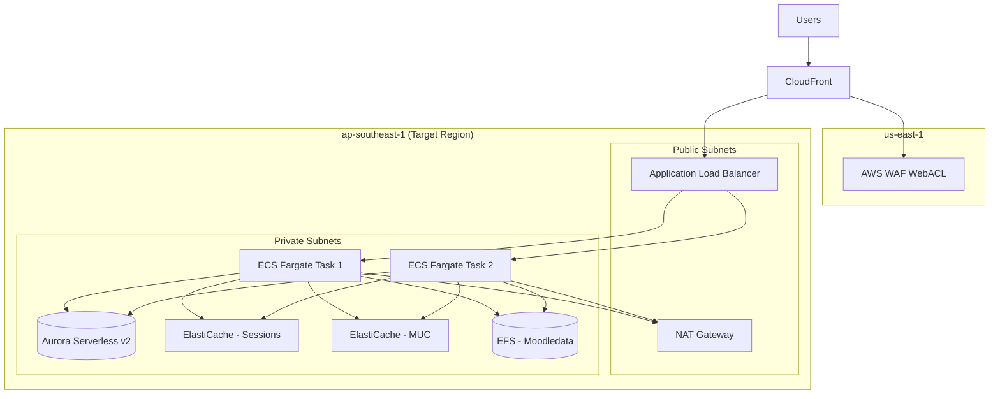
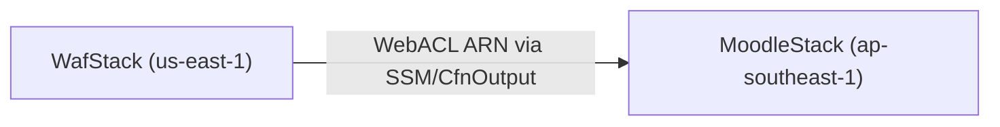
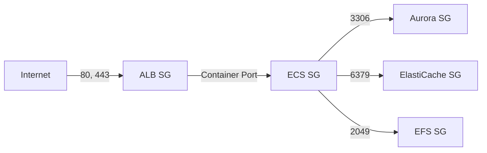

# Design Document: Moodle AWS Deployment

## Overview

This design describes the AWS CDK v2 (TypeScript) infrastructure-as-code project that provisions a production-grade Moodle LMS environment on AWS. The architecture follows the AWS reference pattern for deploying Moodle: Route 53 → CloudFront + WAF → ALB → ECS Fargate → Aurora Serverless v2 + ElastiCache Serverless + EFS.

The CDK project is organized as a multi-stack application with two primary stacks:
1. **WafStack** — deployed to us-east-1 for CloudFront WAF association
2. **MoodleStack** — deployed to the target region (default: ap-southeast-1) containing all other resources

All infrastructure is defined as code with parameterized configuration. No manual AWS Console steps are required for resource provisioning.

### Key Design Decisions

| Decision | Choice | Rationale |
|---|---|---|
| IaC Tool | AWS CDK v2 (TypeScript) | Specified in SRS; type-safe, composable constructs |
| Compute | ECS Fargate (not EC2) | Serverless compute, no instance management |
| Database | Aurora Serverless v2 | Auto-scaling, pay-per-use, MySQL-compatible |
| Cache | ElastiCache Serverless | Auto-scaling, no node management |
| WAF Deployment | Separate stack in us-east-1 | CloudFront WAFs must be in us-east-1 |
| Container Image | Custom Dockerfile in-repo | Reproducible builds, OPcache tuning, cron config |
| Spot Strategy | 75/25 Spot/Standard | Cost savings with availability safety net |

## Architecture

### High-Level Architecture Diagram



### Stack Dependency Diagram



The WafStack exports the WebACL ARN which the MoodleStack consumes as a cross-region reference to associate with the CloudFront distribution.

## Components and Interfaces

### CDK Project Layout

```
moodle-cdk/
├── bin/
│   └── app.ts                    # CDK app entry point
├── lib/
│   ├── config.ts                 # Parameterized configuration interface
│   ├── waf-stack.ts              # WAF WebACL stack (us-east-1)
│   ├── moodle-stack.ts           # Main orchestrating stack
│   ├── constructs/
│   │   ├── networking.ts         # VPC, subnets, endpoints, flow logs
│   │   ├── database.ts           # Aurora Serverless v2 cluster
│   │   ├── cache.ts              # ElastiCache Serverless clusters (session + MUC)
│   │   ├── storage.ts            # EFS filesystem, access points
│   │   ├── compute.ts            # ECS cluster, service, task definition, auto-scaling
│   │   ├── loadbalancer.ts       # ALB, listeners, target group, health checks
│   │   ├── cdn.ts                # CloudFront distribution
│   │   ├── security.ts           # Secrets Manager, KMS keys
│   │   └── monitoring.ts         # CloudWatch logs, alarms, dashboards, CloudTrail, SNS
├── docker/
│   ├── Dockerfile                # Moodle container image
│   └── config/
│       ├── php.ini               # PHP/OPcache configuration
│       ├── moodle-cron.sh        # Cron runner script
│       └── entrypoint.sh         # Container entrypoint
├── test/
│   ├── unit/                     # Unit tests for individual constructs
│   └── property/                 # Property-based tests
├── cdk.json                      # CDK configuration
├── tsconfig.json                 # TypeScript configuration
├── package.json                  # Dependencies
└── README.md                     # Documentation
```

### Component Interfaces

#### Configuration Interface (`config.ts`)

```typescript
export interface MoodleConfig {
  // Environment
  environment: string;           // e.g., "production", "staging"
  region: string;                // Target AWS region (default: ap-southeast-1)
  domainName: string;            // e.g., "lms.ecv.co.th"

  // Compute
  taskCpu: number;               // CPU units per task (default: 2048)
  taskMemory: number;            // MiB per task (default: 4096)
  minTasks: number;              // Minimum ECS tasks (default: 1)
  maxTasks: number;              // Maximum ECS tasks (default: 10)
  cpuTargetUtilization: number;  // Auto-scaling target (default: 50)
  spotPercentage: number;        // Fargate Spot percentage (default: 75)

  // Database
  minAcu: number;                // Aurora min ACU (default: 0.5)
  maxAcu: number;                // Aurora max ACU (default: 10)
  backupRetentionDays: number;   // Backup retention (default: 7)

  // Cache
  maxEcpu: number;               // ElastiCache max ECPU (default: 100)
  maxCacheDataGb: number;        // ElastiCache max data GB (default: 10)

  // OPcache
  opcacheMemory: number;         // OPcache memory MB (default: 512)

  // Tags
  costAllocationTags: Record<string, string>;
}
```

#### Networking Construct (`networking.ts`)

Provisions:
- VPC with 2+ AZs, public and private subnets
- NAT Gateways in public subnets
- VPC Interface Endpoints for ECR (ecr.api, ecr.dkr) and Gateway Endpoint for S3
- VPC Flow Logs to CloudWatch Logs
- Security groups for each component following least-privilege

Exports:
- `vpc: ec2.Vpc`
- `ecsSecurityGroup: ec2.SecurityGroup`
- `dbSecurityGroup: ec2.SecurityGroup`
- `cacheSecurityGroup: ec2.SecurityGroup`
- `efsSecurityGroup: ec2.SecurityGroup`
- `albSecurityGroup: ec2.SecurityGroup`

#### Database Construct (`database.ts`)

Provisions:
- Aurora Serverless v2 cluster (MySQL-compatible)
- Writer + reader instances across AZs
- KMS encryption key
- Automated backups with configurable retention
- Credentials in Secrets Manager with auto-rotation

Inputs: `vpc`, `dbSecurityGroup`, `config`
Exports: `cluster: rds.DatabaseCluster`, `secret: secretsmanager.Secret`

#### Cache Construct (`cache.ts`)

Provisions:
- ElastiCache Serverless cluster for MUC (application cache)
- ElastiCache Serverless cluster for sessions
- TLS enforcement on both clusters

Inputs: `vpc`, `cacheSecurityGroup`, `config`
Exports: `sessionCacheEndpoint: string`, `mucCacheEndpoint: string`

#### Storage Construct (`storage.ts`)

Provisions:
- EFS filesystem with elastic throughput
- Transit encryption enforcement
- Lifecycle policy (30-day IA transition)
- Mount targets in each private subnet
- Access points for moodledata, cache, and temp directories

Inputs: `vpc`, `efsSecurityGroup`
Exports: `fileSystem: efs.FileSystem`, `accessPoints: Record<string, efs.AccessPoint>`

#### Compute Construct (`compute.ts`)

Provisions:
- ECS Cluster with Fargate capacity providers (Spot + Standard)
- Task definition with container, EFS mounts, secrets references, OPcache config
- ECS Service with desired count, circuit breaker, deployment configuration
- Auto-scaling policy (CPU target tracking)
- ECR repository for Moodle Docker image

Inputs: `vpc`, `ecsSecurityGroup`, `fileSystem`, `accessPoints`, `dbSecret`, `cacheEndpoints`, `albTargetGroup`, `config`
Exports: `service: ecs.FargateService`, `repository: ecr.Repository`

#### Load Balancer Construct (`loadbalancer.ts`)

Provisions:
- ALB in public subnets
- HTTPS listener with ACM certificate
- HTTP listener with redirect to HTTPS
- Target group with health check configuration

Inputs: `vpc`, `albSecurityGroup`, `config`
Exports: `alb: elbv2.ApplicationLoadBalancer`, `targetGroup: elbv2.ApplicationTargetGroup`

#### CDN Construct (`cdn.ts`)

Provisions:
- CloudFront distribution with ALB origin
- Cache behaviors for static assets
- ACM certificate (us-east-1) association
- WAF WebACL association (cross-region reference)
- Origin request policy forwarding required headers

Inputs: `alb`, `wafWebAclArn`, `config`
Exports: `distribution: cloudfront.Distribution`

#### Security Construct (`security.ts`)

Provisions:
- KMS keys for database, cache, and EFS encryption
- Secrets Manager entries for Moodle admin credentials and API keys
- Auto-rotation configuration on all secrets

Inputs: `config`
Exports: `kmsKeys: Record<string, kms.Key>`, `secrets: Record<string, secretsmanager.Secret>`

#### Monitoring Construct (`monitoring.ts`)

Provisions:
- CloudWatch Log Groups for ECS containers
- CloudWatch Alarms (CPU, memory, ALB latency)
- CloudWatch Dashboard
- CloudTrail trail with encrypted S3 bucket
- SNS topic for Aurora event subscriptions
- Aurora event subscriptions (availability, failure, maintenance, low storage)

Inputs: `service`, `cluster`, `alb`, `config`
Exports: `dashboard: cloudwatch.Dashboard`, `snsTopic: sns.Topic`

#### WAF Stack (`waf-stack.ts`)

Provisions:
- WAF WebACL with AWS managed rule groups (AWSManagedRulesCommonRuleSet, AWSManagedRulesKnownBadInputsRuleSet)
- Deployed in us-east-1

Exports: `webAclArn: string` (via CfnOutput for cross-region reference)

### Security Group Rules



## Data Models

### CDK Configuration Schema

The configuration is loaded from `cdk.json` context or environment-specific config files:

```typescript
// cdk.json context example
{
  "context": {
    "moodle:environment": "production",
    "moodle:region": "ap-southeast-1",
    "moodle:domainName": "lms.ecv.co.th",
    "moodle:taskCpu": 2048,
    "moodle:taskMemory": 4096,
    "moodle:minTasks": 1,
    "moodle:maxTasks": 10,
    "moodle:cpuTargetUtilization": 50,
    "moodle:spotPercentage": 75,
    "moodle:minAcu": 0.5,
    "moodle:maxAcu": 10,
    "moodle:backupRetentionDays": 7,
    "moodle:maxEcpu": 100,
    "moodle:maxCacheDataGb": 10,
    "moodle:opcacheMemory": 512
  }
}
```

### Configuration Validation Rules

| Parameter | Type | Constraint |
|---|---|---|
| taskCpu | number | Must be valid Fargate CPU value (256, 512, 1024, 2048, 4096) |
| taskMemory | number | Must be valid for chosen CPU per Fargate limits |
| minTasks | number | >= 1 |
| maxTasks | number | >= minTasks |
| cpuTargetUtilization | number | 1-100 |
| spotPercentage | number | 0-100 |
| minAcu | number | >= 0.5 |
| maxAcu | number | >= minAcu, <= 128 |
| backupRetentionDays | number | 1-35 |
| opcacheMemory | number | 128-512 |

### Container Filesystem Layout

| Mount Path | Source | Purpose |
|---|---|---|
| /var/www/moodle/html | Container image | Moodle application code (read-only at runtime) |
| /var/www/moodle/local | Ephemeral (container) | Local OPcache, temp processing |
| /var/www/moodle/data | EFS access point | Moodledata — user uploads, shared data |
| /var/www/moodle/cache | EFS access point | Moodle file cache (shared) |
| /var/www/moodle/temp | EFS access point | Temporary files (shared) |

### CloudFormation Outputs

The stacks export key values for operational use:

| Output | Stack | Description |
|---|---|---|
| WebAclArn | WafStack | WAF WebACL ARN for CloudFront association |
| CloudFrontDomainName | MoodleStack | CloudFront distribution domain |
| AlbDnsName | MoodleStack | ALB DNS name |
| EcrRepositoryUri | MoodleStack | ECR repository URI for Docker push |
| AuroraClusterEndpoint | MoodleStack | Aurora writer endpoint |
| SessionCacheEndpoint | MoodleStack | ElastiCache session endpoint |
| MucCacheEndpoint | MoodleStack | ElastiCache MUC endpoint |


## Correctness Properties

*A property is a characteristic or behavior that should hold true across all valid executions of a system — essentially, a formal statement about what the system should do. Properties serve as the bridge between human-readable specifications and machine-verifiable correctness guarantees.*

The following properties are derived from the acceptance criteria in the requirements document. Since this is an infrastructure-as-code project, properties are verified by synthesizing the CDK stacks into CloudFormation templates and asserting structural invariants on the resulting JSON/YAML. For any valid `MoodleConfig`, the synthesized template must satisfy these properties.

### Property 1: VPC Structure Completeness

*For any* valid MoodleConfig, the synthesized MoodleStack template SHALL contain a VPC spanning at least 2 Availability Zones, with both public and private subnet types, NAT Gateways in public subnets, VPC interface endpoints for ECR (ecr.api, ecr.dkr), a gateway endpoint for S3, and a VPC FlowLog resource delivering to CloudWatch Logs.

**Validates: Requirements 1.1, 1.2, 1.3, 1.4, 1.5**

### Property 2: Security Group Least-Privilege Chain

*For any* synthesized MoodleStack template, each security group SHALL only permit inbound traffic from its direct upstream dependency on the expected port: ALB SG accepts 80/443 from 0.0.0.0/0, ECS SG accepts the container port from ALB SG only, Aurora SG accepts port 3306 from ECS SG only, ElastiCache SG accepts port 6379 from ECS SG only, and EFS SG accepts port 2049 from ECS SG only.

**Validates: Requirements 1.6, 2.7, 3.5, 4.5, 6.5**

### Property 3: Aurora Serverless v2 Configuration

*For any* valid MoodleConfig with minAcu and maxAcu values, the synthesized template SHALL contain an Aurora Serverless v2 cluster with MySQL-compatible engine, ServerlessV2ScalingConfiguration matching the configured min/max ACU, at least 2 DB instances across different AZs, and BackupRetentionPeriod matching the configured retention days.

**Validates: Requirements 2.1, 2.2, 2.3, 2.4**

### Property 4: Secrets Management Completeness

*For any* synthesized MoodleStack template, all sensitive credentials (database master password, Moodle admin password) SHALL be stored in Secrets Manager resources with rotation schedules configured, and the ECS task definition container definition SHALL reference these values via the `secrets` property (not `environment`).

**Validates: Requirements 2.5, 8.1, 8.2, 8.5**

### Property 5: Encryption at Rest

*For any* synthesized MoodleStack template, the Aurora cluster SHALL have StorageEncrypted set to true with a KMS key reference, each ElastiCache Serverless resource SHALL have encryption at rest enabled, and the EFS filesystem SHALL have encryption enabled with a KMS key reference.

**Validates: Requirements 2.6, 8.3**

### Property 6: Encryption in Transit

*For any* synthesized MoodleStack template, each ElastiCache Serverless resource SHALL have TransitEncryptionEnabled set to true, the EFS mount configuration in the ECS task definition SHALL enforce TLS, and the Aurora cluster connection configuration SHALL use SSL.

**Validates: Requirements 3.4, 4.2, 8.4**

### Property 7: Dual ElastiCache Clusters

*For any* valid MoodleConfig, the synthesized template SHALL contain exactly 2 ElastiCache Serverless resources (one for MUC, one for sessions), each with the configured ECPU and data storage limits.

**Validates: Requirements 3.1, 3.2, 3.3**

### Property 8: EFS Configuration

*For any* valid MoodleConfig, the synthesized template SHALL contain an EFS filesystem with elastic throughput mode, a lifecycle policy transitioning to Infrequent Access after 30 days, and mount targets in every private subnet used by the VPC.

**Validates: Requirements 4.1, 4.3, 4.4**

### Property 9: ECS Compute Configuration

*For any* valid MoodleConfig, the synthesized template SHALL contain an ECS Fargate service with: task definition CPU and memory matching the config, capacity provider strategy with the configured Spot/Standard weight split, auto-scaling with the configured target utilization and min/max task counts, a deployment circuit breaker with rollback enabled, network configuration with AssignPublicIp DISABLED, and an ECR repository resource.

**Validates: Requirements 5.1, 5.2, 5.3, 5.6, 5.7, 5.8**

### Property 10: ECS Task Definition Mounts

*For any* synthesized MoodleStack template, the ECS task definition SHALL define EFS volume mounts for the Moodledata path (/var/www/moodle/data), cache path (/var/www/moodle/cache), and temp path (/var/www/moodle/temp), each referencing the EFS filesystem and corresponding access points.

**Validates: Requirements 5.4**

### Property 11: ALB Configuration

*For any* synthesized MoodleStack template, the ALB SHALL be internet-facing in public subnets, have an HTTPS listener on port 443 with an ACM certificate, have an HTTP listener on port 80 with a redirect action to HTTPS, and have a target group with health check configuration.

**Validates: Requirements 6.1, 6.2, 6.3, 6.4**

### Property 12: CloudFront and WAF Association

*For any* synthesized stack set, the WafStack SHALL contain a WebACL with at least one managed rule group, the MoodleStack SHALL contain a CloudFront distribution with the ALB as origin, and the distribution SHALL reference the WAF WebACL ARN and an ACM certificate.

**Validates: Requirements 7.1, 7.3, 7.4, 7.5**

### Property 13: Monitoring and Alerting Completeness

*For any* synthesized MoodleStack template, the template SHALL contain: CloudWatch Log Groups for ECS containers, CloudWatch Alarms for CPU utilization, memory utilization, and ALB response time, a CloudTrail trail with an encrypted S3 bucket, RDS EventSubscriptions for availability/failure/maintenance/low-storage events with an SNS topic, and a CloudWatch Dashboard.

**Validates: Requirements 9.1, 9.2, 9.3, 9.4, 9.5**

### Property 14: Configuration Parameterization

*For any* two valid MoodleConfig instances with different values for taskCpu, taskMemory, minTasks, maxTasks, minAcu, maxAcu, or domainName, the synthesized templates SHALL differ in the corresponding resource properties, confirming that configuration parameters are properly threaded through to resources.

**Validates: Requirements 11.3**

### Property 15: Cost Allocation Tags

*For any* valid MoodleConfig with costAllocationTags, every taggable resource in the synthesized MoodleStack template SHALL include those tags.

**Validates: Requirements 12.4**

## Error Handling

### CDK Synthesis Errors

| Error Scenario | Handling |
|---|---|
| Invalid config values (e.g., taskCpu not a valid Fargate value) | Config validation function throws descriptive error before synthesis |
| Missing required config (e.g., no domainName) | Config validation lists all missing required fields |
| Invalid ACU range (minAcu > maxAcu) | Config validation rejects with constraint explanation |
| Invalid scaling range (minTasks > maxTasks) | Config validation rejects with constraint explanation |

### Deployment Errors

| Error Scenario | Handling |
|---|---|
| ECS task fails to start | Circuit breaker detects failure, triggers automatic rollback |
| Aurora cluster creation fails | CloudFormation rolls back the stack; credentials cleaned from Secrets Manager |
| Cross-region WAF reference fails | WafStack must be deployed first; CDK app enforces dependency via `addDependency` |
| ACM certificate not validated | Deployment blocks at ALB/CloudFront listener creation; documented in README as prerequisite |

### Runtime Errors

| Error Scenario | Handling |
|---|---|
| ECS task unhealthy | ALB health check removes task from target group; auto-scaling replaces it |
| Aurora failover | Multi-AZ reader promoted automatically; application reconnects via cluster endpoint |
| ElastiCache node failure | Serverless mode handles failover transparently |
| EFS throughput exceeded | Elastic throughput mode scales automatically |
| Spot instance reclamation | Fargate Spot tasks replaced; 25% standard capacity provides baseline |

## Testing Strategy

### Testing Framework

- **Unit Tests**: Jest with `aws-cdk-lib/assertions` module for CloudFormation template assertions
- **Property-Based Tests**: [fast-check](https://github.com/dubzzz/fast-check) library for generating random valid configurations and verifying template invariants
- **Test Runner**: Jest (included with CDK TypeScript template)

### Unit Tests

Unit tests verify specific examples and edge cases using CDK's `Template.fromStack()` assertions:

- Each construct gets a dedicated test file (e.g., `test/unit/networking.test.ts`)
- Tests synthesize the construct with a known configuration and assert specific resource properties
- Edge cases: minimum config values, maximum config values, single-AZ fallback behavior
- Error conditions: invalid config values, missing required parameters

### Property-Based Tests

Property-based tests use fast-check to generate random valid `MoodleConfig` instances and verify that all 15 correctness properties hold across the configuration space.

Configuration:
- Minimum 100 iterations per property test
- Each test tagged with: **Feature: moodle-aws-deployment, Property {N}: {title}**
- Each correctness property maps to exactly one property-based test
- Custom fast-check arbitraries for `MoodleConfig` respecting Fargate CPU/memory constraints

### Test Organization

```
test/
├── unit/
│   ├── networking.test.ts      # VPC, subnets, endpoints, flow logs
│   ├── database.test.ts        # Aurora cluster configuration
│   ├── cache.test.ts           # ElastiCache clusters
│   ├── storage.test.ts         # EFS filesystem
│   ├── compute.test.ts         # ECS service, task definition, auto-scaling
│   ├── loadbalancer.test.ts    # ALB, listeners, health checks
│   ├── cdn.test.ts             # CloudFront distribution
│   ├── security.test.ts        # Secrets Manager, KMS
│   ├── monitoring.test.ts      # CloudWatch, CloudTrail, SNS
│   └── waf-stack.test.ts       # WAF WebACL
├── property/
│   ├── arbitraries.ts          # fast-check arbitraries for MoodleConfig
│   └── stack-properties.test.ts # All 15 correctness property tests
└── jest.config.ts
```

### Test Execution

Tests are run via Jest in single-execution mode:

```bash
npx jest --run
```

Property tests should be tagged with comments referencing the design property:

```typescript
// Feature: moodle-aws-deployment, Property 1: VPC Structure Completeness
it.prop([validMoodleConfigArb], (config) => {
  const template = synthesizeStack(config);
  // assertions...
});
```
